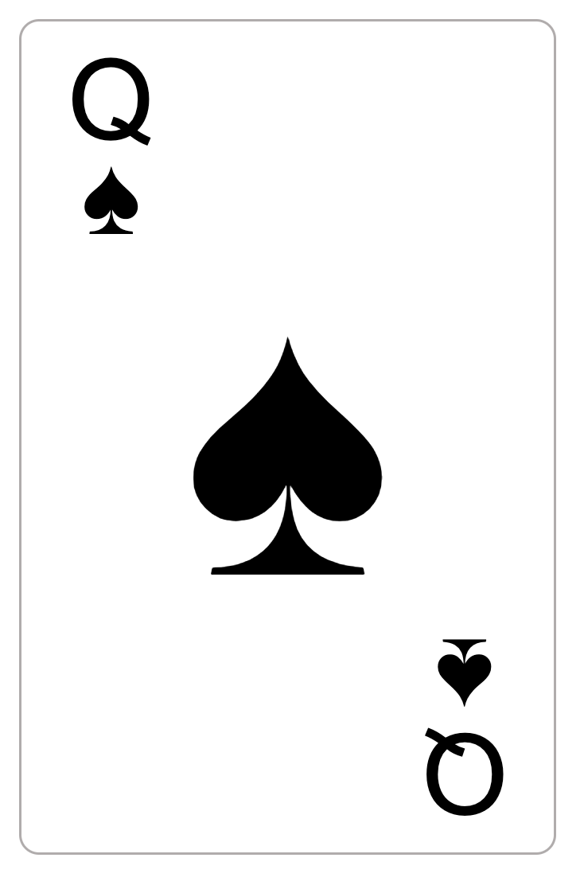

# react-playing-cards

Various card components for React.

## Currently implemented components

- Playing cards

## Usage

1. Install the `Sigmar One` -font from Google Fonts and include it in your `</head>`-tag.
2. Run `npm i @alehuo/react-playing-cards`
3. Check one of the examples below

### Playing cards

```typescript
import { PlayingCard } from "@alehuo/react-playing-cards";
import React from "react";
import ReactDOM from "react-dom";

ReactDOM.render(
  document.getElementById("app"),
  <div>
    <PlayingCard value={12} suit="spades" />
  </div>
);
```



## Installation

Run `npm install`.

## Building

Run `npm run build`

## Development

Run `npm watch` to preview the components.

### Requirements for development

- Node.js v16 (`.nvmrc` file is provided)

## License

MIT license.
